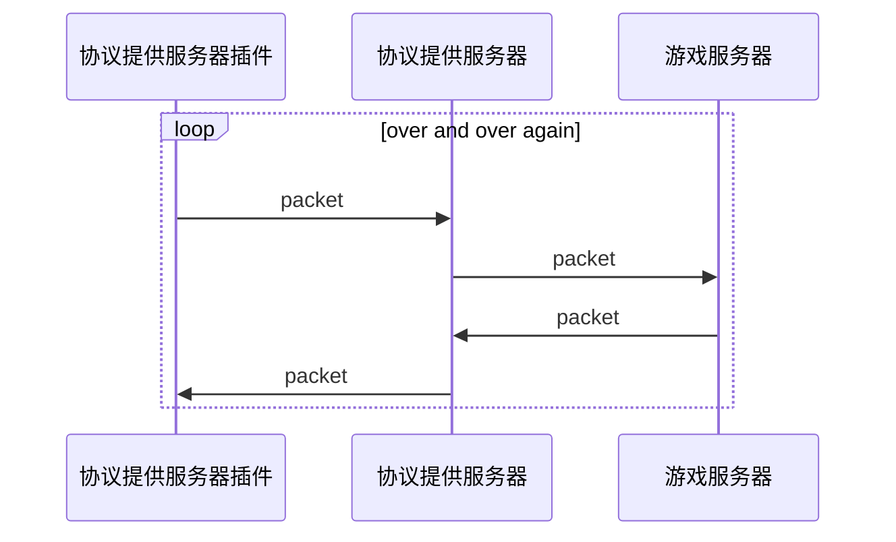
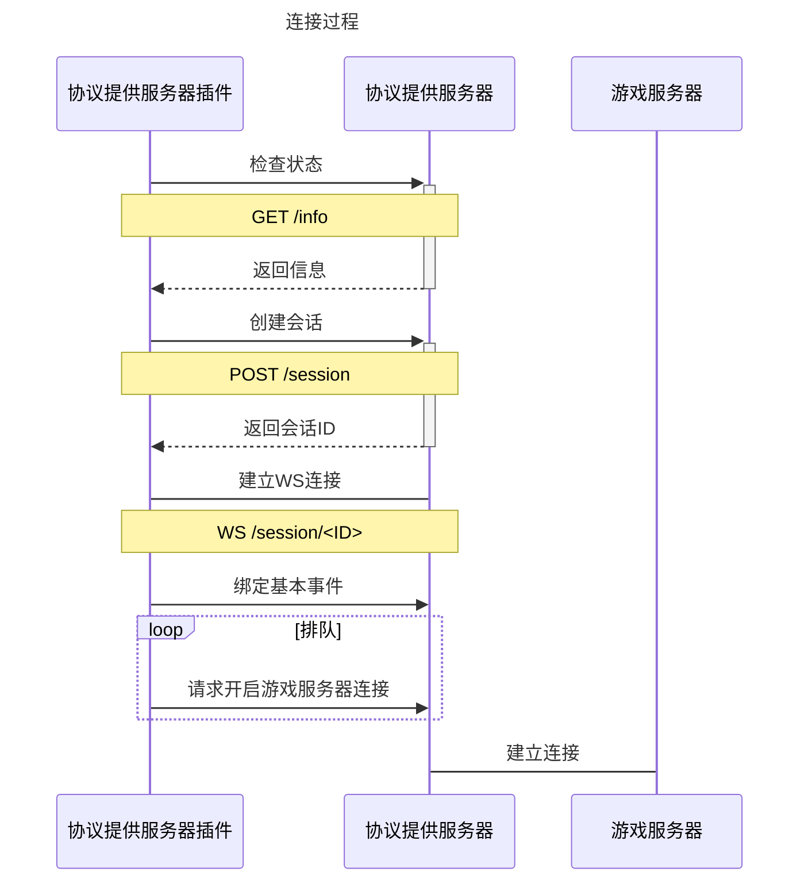

# 协议提供服务器

通过**协议提供服务器**间接对**游戏服务器**进行连接, 所有与**游戏服务器**的交互发生在**协议提供服务器**.

这意味着在MineChat客户端上只与**协议提供服务器**建立了连接, 你的所有的尝试与**游戏服务器**的交互都会交给**协议提供服务器**处理后转发给**游戏服务器**. **游戏服务器**的消息会由**协议提供服务器**处理再由**协议提供服务器**回传给MineChat客户端.



## 📝 添加服务器

| 名称      | 默认值              | 附加信息                             |
| ------- | ---------------- | -------------------------------- |
| 协议提供服务器 | 默认协议提供服务器        | 用于当前会话的协议提供服务器                   |
| 连接账户    | 默认账户             | 用于当前会话的账户                        |
| 显示名称    | Minecraft Server | 在服务器列表中显示的标题                     |
| 地址      | 127.0.0.1        | 游戏服务器的地址                         |
| 端口      | 19132            | 游戏服务器的端口                         |
| 会话附加属性  | {}               | 在创建会话时会在请求体中加入该内容, 优先级大于全局会话附加属性 |

## 🎲 插件配置页

| 名称        | 默认值            | 附加信息              |
| --------- | -------------- | ----------------- |
| 默认协议提供服务器 | 127.0.0.1:8873 | 默认用于会话的协议提供服务器    |
| 全局会话附加属性  | {}             | 在创建会话时会在请求体中加入该内容 |

## 🔧 开发者资源


所有WS包的结构都是:
```json5
{
    type: 'string',
    data: 'any'
}
```


### 向插件发送包

### 添加事件监听

### 开发协议提供服务器

协议提供服务器使用http, 使得可以让协议插件开发不局限于Jvm语言\
你可以自行实现以下接口, 实现你自己的协议提供服务器!

你可以参考MineChat官方开发的协议提供服务器:





#### 基本接口



用于获取当前协议提供服务器信息



```json5
{
    description: 'string',          // 描述文本
    backend: 'string',              // 后端实现
    online: 'number',               // 在线连接数
    bedrock_protocols: ['number'],  // 支持的基岩版协议列表
    java_protocols: ['number']      // 支持的Java版协议列表
}
```





当MineChat客户端无法直接获取游戏服务器motd时, 将请求该接口尝试交给协议提供服务器来获取游戏服务器的motd并返回



游戏服务器地址



游戏服务器端口



```json5
{
    summary: 'string',   // 服务器总结信息
    delay: 'number',     // 服务延迟
    count: 'string',     // 服务人数信息
    icon: 'string|null'  // 服务器base64图标
}
```





只是带上配置尝试创建一个会话, 此时还未与游戏服务器连接



游戏服务器地址



游戏服务器端口



是否是离线账户 (默认false)



用户名 (离线账户必须)



```json5
{
    code: 0,
    message: "success",
    data: {
        session_id: 'string'  // 创建会话的UUID
    }
}
```



#### Websocket
