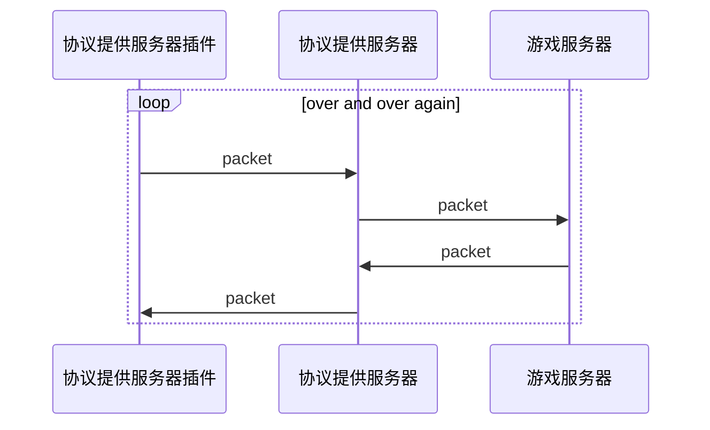

# 协议提供服务器

通过**协议提供服务器**间接对**游戏服务器**进行连接, 所有与**游戏服务器**的交互发生在**协议提供服务器**.

这意味着在MineChat客户端上只与**协议提供服务器**建立了连接, 你的所有的尝试与**游戏服务器**的交互都会交给**协议提供服务器**处理后转发给**游戏服务器**. **游戏服务器**的消息会由**协议提供服务器**处理再由**协议提供服务器**回传给MineChat客户端.

## 📝 添加服务器

## 🎲 插件配置页

## 🔧 开发者资源
### 向插件发送包
### 添加事件监听
### 开发协议提供服务器

[//]: # (### `void sendPacket&#40;String name, Object obj&#41;`)
[//]: # (### `sendPacket&#40;Ljava/lang/String;Ljava/lang/Object;&#41;V`)
[//]: # (### `void addOnEvent&#40;String name, Consumer<Object> callback&#41;`)
[//]: # (### `addOnEvent&#40;Ljava/lang/String;Ljava/util/function/Consumer<Ljava/lang/Object;>;&#41;V`)
