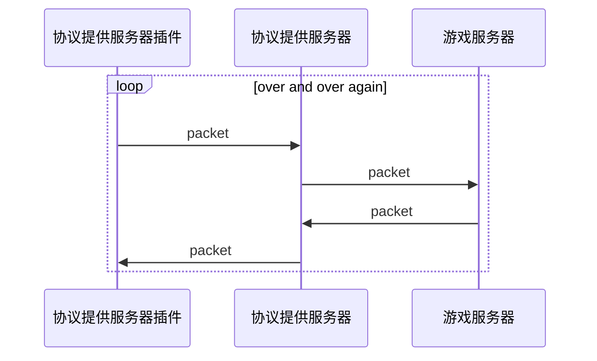

# 协议提供服务器

通过**协议提供服务器**间接对**游戏服务器**进行连接, 所有与**游戏服务器**的交互发生在**协议提供服务器**.

这意味着在MineChat客户端上只与**协议提供服务器**建立了连接, 你的所有的尝试与**游戏服务器**的交互都会交给**协议提供服务器**处理后转发给**游戏服务器**. **游戏服务器**的消息会由**协议提供服务器**处理再由**协议提供服务器**回传给MineChat客户端.

## 📝 添加服务器

| 名称      | 默认值              | 附加信息 |
| ------- | ---------------- | ---- |
| 协议提供服务器 |                  |      |
| 连接账户    |                  |      |
| 显示名称    | Minecraft Server |      |
| 地址      | 127.0.0.1        |      |
| 端口      | 19132            |      |
| 会话附加属性  |                  |      |

## 🎲 插件配置页

## 🔧 开发者资源

### 向插件发送包

...

### 添加事件监听

...

### 开发协议提供服务器



用于获取当前协议提供服务器信息









当MineChat客户端无法直接获取游戏服务器motd时, 将请求该接口尝试交给协议提供服务器来获取游戏服务器的motd并返回









只是带上配置尝试创建一个会话, 此时还未与游戏服务器连接






