# 协议提供服务器

通过**协议提供服务器**间接对**游戏服务器**进行连接, 所有与**游戏服务器**的交互发生在**协议提供服务器**.

这意味着在MineChat客户端上只与**协议提供服务器**建立了连接, 你的所有的尝试与**游戏服务器**的交互都会交给**协议提供服务器**处理后转发给**游戏服务器**. **游戏服务器**的消息会由**协议提供服务器**处理再由**协议提供服务器**回传给MineChat客户端.

```mermaid
sequenceDiagram
    participant plugin as 协议提供服务器插件
    participant protocol_server as 协议提供服务器
    participant server as 游戏服务器
    loop over and over again
        plugin ->> protocol_server: packet
        protocol_server ->> server: packet
        server ->> protocol_server: packet
        protocol_server ->> plugin: packet
    end
```



## 📝 添加服务器

<details>

<summary>储存结构</summary>


```json5
{
    host: 'string',
    port: 'number',
    account: 'number|null',
    protocol_server: 'string|null',
    name: 'string',
    options: {}
}
```


</details>

| 名称      | 默认值              | 附加信息 |
| ------- | ---------------- | ---- |
| 协议提供服务器 |                  |      |
| 连接账户    |                  |      |
| 显示名称    | Minecraft Server |      |
| 地址      | 127.0.0.1        |      |
| 端口      | 19132            |      |
| 会话附加属性  |                  |      |

## 🎲 插件配置页

## 🔧 开发者资源

### 向插件发送包

### 添加事件监听

### 开发协议提供服务器

协议提供服务器使用http, 使得可以让开发不局限于Java\
你可以自行实现以下接口, 实现你自己的协议提供服务器!

```mermaid
---
title: 连接过程
---
sequenceDiagram
    participant plugin as 协议提供服务器插件
    participant protocol_server as 协议提供服务器
    participant server as 游戏服务器
    
    plugin ->>+ protocol_server: 检查状态
    Note over plugin, protocol_server: GET /info
    protocol_server -->>- plugin: 返回信息
    
    plugin ->>+ protocol_server: 创建会话
    Note over plugin, protocol_server: POST /session
    protocol_server -->>- plugin: 返回会话ID

    plugin -> protocol_server: 建立WS连接
    Note over plugin, protocol_server: WS /session/<ID>

    plugin ->> protocol_server: 绑定基本事件
    loop 排队
        plugin ->> protocol_server: 请求开启游戏服务器连接
    end

    protocol_server -> server: 建立连接
```



#### 基本接口



用于获取当前协议提供服务器信息



```json5
{
    description: 'string',          // 描述文本
    backend: 'string',              // 后端实现
    online: 'number',               // 在线连接数
    bedrock_protocols: ['number'],  // 支持的基岩版协议列表
    java_protocols: ['number']      // 支持的Java版协议列表
}
```





当MineChat客户端无法直接获取游戏服务器motd时, 将请求该接口尝试交给协议提供服务器来获取游戏服务器的motd并返回



游戏服务器地址



游戏服务器端口



```json5
{
    summary: 'string',  // 服务器总结信息
    delay: 'number',    // 服务延迟
    count: 'string',    // 服务人数信息
    icon: 'string'      // 服务器base64图标 (nullable)
}
```





只是带上配置尝试创建一个会话, 此时还未与游戏服务器连接



游戏服务器地址



游戏服务器端口



是否是离线账户 (默认false)



用户名 (离线账户必须)



```json5
{
    code: 0,
    message: "success",
    data: {
        session_id: 'string'  // 创建会话的UUID
    }
}
```



#### Websocket
